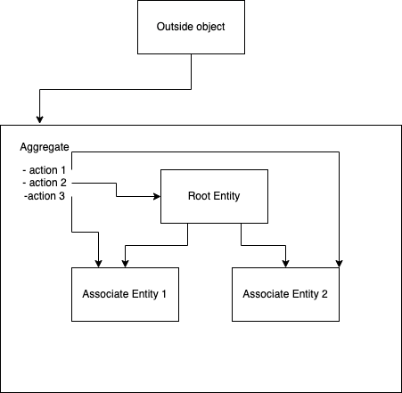

# Learning Hour: Domain-Driven Design - Patterns

In this learning hour we'll explore what design patterns are available to us to implement our domain model in the code.

## Layered Architecture

Here are the classic layers that often are used with DDD:

Where:

- Presentation layer - non-smart user interface that basically knows how to render stuff and accept user's inputs and 
  actions and delegate the handling to the application layer
- Application layer - thin layer that sits between UI and domain code. It doesn't have the business logic, and it is
  used for translation between UI and business domain. Additionally, it may contain application configuration and
  application state (but not state of domain concepts).
- Domain layer - this is the main layer of the application and probably grows the biggest as the software evolves.
  This contains all the business logic and maintains the state of business domain concepts. It receives inputs and
  actions from the application layer, and uses infrastructure layer for state storage and communication with third-
  -party services.
- Infrastructure layer - this layer is essentially a supporting library that helps the rest of the layers. This means
  that it has implementation details of persistence, 3rd-party service communication, dependency injection framework,
  presentation layer library, etc.

Additionally, most of the code will lend itself to the Ports & Adapters (Hexagonal) architecture:

## Entity

An object with identity. Usually, persisted in the database, and when loaded into memory, can't have more than two
with the same ID.

Such an object may contain business logic behaviors directly on it in form of methods.

The infrastructure layer makes sure that loaded entities are cached - e.g., if you request the same entity with the 
same ID again in a different part of the code, you'll actually get the same object instance. However, entity object 
may be off-loaded from memory sometimes. And then it would need to be re-loaded from the database. Infrastructure 
layer makes this transparent.

Example of such entity object would be a "Person."

## Value Objects

An object that doesn't have an identity. These are the objects that don't represent the entire business domain entity
and are perhaps only part of it. The best way to think about this as a "primitive" type in your domain.

For example, if you have an entity "Person", then you might have a primitive type "Address". However, in some domains
even address would have an identity.

Regarding the functionality that exists on value objects - they can start out as pure data structures (no logic, only
data), however, they will naturally attract some functionality as methods that represents common operations and
transformations on this primitive type in the domain.

## Service

Service objects or functions contain domain behaviors that don't naturally belong to any entity or value object.

When you look at your domain model, there will be nouns and verbs that these nouns can perform. These can be obviously
mapped to entities, value objects (nouns) and their methods (verbs).

However, there are sometimes very important behaviors that don't seem to fit any of the noun objects, especially, when
they operate on multiple nouns at once. These are a good fit for being a service object or function.

Important properties of a service:

- Behavior doesn't naturally belong to any entity or value object.
- Refers to other objects of the domain.
- Stateless.

Trivia:

Historically, DDD was applied in the programming languages where it was hard, awkward or impossible to have a function
not attached as a method to an object, and hence most understand Service as an object.

If your programming language allows you to have free functions (without object holding them), then it's absolutely
fine to create service functions, unless you have to factor complexity as an object, of course.

Moreover, some programming languages allow creation of so-called "modules", that can contain the functions on them
just like objects do, however, these don't need to be instantiated and can be called directly on the module. When you
have this available in your language, then this is probably the first candidate for service implementation. (Don't
confuse this with the Module pattern)

## Module / Package

As your model grows, it'll become too big to reason about it all at once. Additionally, there would be concepts that
belong closer together.

It makes sense to put these concepts into a single module. When domain concepts get distributed among a number of
modules like this, you'll be able to see a bigger picture by looking at dependencies between modules.

Important properties of module:

- Concepts inside of module have high cohesion between each other, and they are closely related.
- Dependencies between modules are explicit and module boundary is hard to cross.
- Coupling between modules is low.

## Aggregate

Aggregates solve the problem of maintaining relations between the objects, and controlling the objects' lifecycle,
such as creation, persistence in memory and in database, caching, archival and permanent deletion.

This is simple when you have only one object to take care about, but when you have multiple inter-connected entities,
then you have to model these lifecycle events more carefully, taking into account all the relationships, constraints,
and invariants.

In the end, the aggregate is a group of objects that need to be considered as one whole unit for the purposes of the
data changes.

Only one object is exposed to the outside from the aggregate - root entity. Then the root entity holds references to
other objects in the aggregate, and any action that needs to be performed on the other objects, will have to go
through one of the methods of the root entity.

This can be designed in two ways: either let the root entity have all these extra methods, and then it becomes the
essence of the aggregate, or alternatively, it's possible to have a separate aggregate object that has these methods.

When root entity is the essence of the aggregate:

When there is a separate Aggregate object to hold the actions as methods:

You should prefer the first option when there is a clear Root Entity for all actions that you need for this
aggregate from domain perspective. However, if it's not clear, and it's hard to decide which entity should be root,
and methods don't naturally belong to any of the entities, then you should consider the option number two. Moreover,
it's possible that you have a problem in the model design, so going back to whiteboard and changing the model so 
that the aggregate root entity makes sense is also an option you should consider.

Another interesting note about aggregates - only the root entity has to have global identity. The associated objects
can have local identity that only makes sense in the scope of this particular instance of the aggregate.

Additionally, the objects inside of one aggregate can hold (and use) reference to other aggregates of the same or
of different type.

## Factory

Aggregates and their constituents may become complex to construct, so factory pattern is useful to abstract this.

[read more](https://github.com/tddfellow/learning-hour-design-patterns-2#factory)

## Repository

This allows to easily obtain root entities from the database. That's because in the majority of the cases the root 
entity will be stored in the database.

In the scope of DDD, the repository is also responsible to instantiating the whole aggregate for the fetched root
entity.

[read more](https://github.com/tddfellow/learning-hour-design-patterns-1#repository)

## Kata: Model as Types

1. Split into pairs.
2. Take the model you created in the [previous exercise](https://github.com/tddfellow/learning-hour-ddd-goal).
3. Create types and interfaces to represent this model using the patterns above (no implementation necessary).
4. Each pair presents their results to the whole group.
